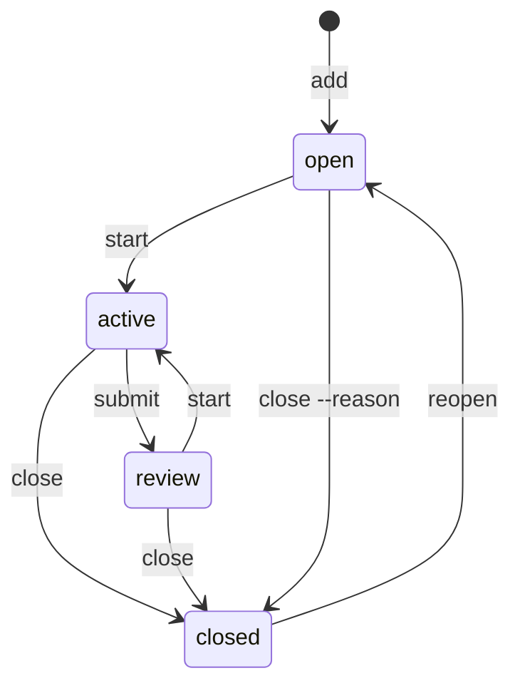

A Task is a piece of work with a log. Its state is always a command's move, never an edit.

## The lifecycle



`start` takes a Task into work, and takes it back from review. `submit` hands the work to a human when one accepts it; the human's `start` takes it back or their `close` accepts it. Review is optional: a solo agent closes straight from active. `reopen` is explicit and leaves a log entry. An invalid move is refused with the moves that are legal:

```
$ anb submit task.ship-the-parser
error[invalid-transition]: `task.ship-the-parser` is open; valid: start, close --reason
try: anb start task.ship-the-parser
try: anb close task.ship-the-parser --reason "<why>"
```

## Closing with a proof

Finished work stays auditable, so `close` carries a proof. The proofs are equals; one is the default because it travels with the notebook.

| Flag | Proof |
|---|---|
| `--note <file>` | the report file, ingested as a Note the notebook carries; the default route |
| `--pr <url>` | the pull request that shipped the work |
| `--sha <sha>` | the commit that shipped the work |
| `--report <path>` | a file left where it lies: right for a living document, which a Note would freeze into a second source of truth |
| `--no-proof` | the explicit waiver: done, nothing to show |
| `--reason "<why>"` | work that will never happen, ended from any state, open included |

```
$ anb close task.parser-accepts-fenced-bodies --note report.md
ok: close task.parser-accepts-fenced-bodies — active→closed
report: note.report-parser-accepts-fenced-bodies
```

A close names what it unblocked, so the next Task is known without a second query, and names the Questions still attached to the Task, so a deferred doubt is not lost. `anb archive <id>` moves the closed Task into `archive/tasks/` with its log and carries the report Note along; a closed record left live is a leftover somebody else has to find.

## Holds

A pause is deliberate and carries its reason; a hold without a reason is where work rots.

```
$ anb hold task.negative-corpus-wired-into-ci --reason "waits for the corpus license"
ok: hold task.negative-corpus-wired-into-ci — held
```

`--until <date>` adds a calendar date to resume on. A held Task leaves the queue and the `active:` line and waits in Status under `held`; a hold older than the `debt-hold-stale` clock (14 days by default) surfaces as Debt. `anb unhold <id>` resumes it.

## Dependencies

`anb block <id> <on>` writes an edge: the first Task waits on the second. The edge is refused when it would close a cycle, and the refusal walks the cycle in full, so `ready` cannot silently empty forever. `anb unblock <id> <on>` erases it. A Task with an open edge is not ready; when the last Task it waits on closes, the close names it as unblocked.

## Hubs and epics

Work is rarely a flat list, and the notebook has no fifth record type for an epic. An epic is a hub Task tagged `epic`; every Task born inside it is created `--from` the hub, and the hub is blocked by its children:

```
$ anb add task "Ship the parser" --tag epic
ok: add task.ship-the-parser — tasks/task.ship-the-parser.md

$ anb add task "Negative corpus wired into CI" --from task.ship-the-parser
ok: add task.negative-corpus-wired-into-ci — tasks/task.negative-corpus-wired-into-ci.md

$ anb block task.ship-the-parser task.negative-corpus-wired-into-ci
ok: block task.ship-the-parser — waits on task.negative-corpus-wired-into-ci
```

The hub becomes ready when its last child closes; closing it is the epic's acceptance. `anb ready --for <hub>` and `anb list --for <hub>` see one epic's work, and Status shows every hub's progress as `closed/total` with its next Task. Origin is written at `add` time, so create children this way from the start; `anb edit <id> --from <hub>` sets it later.

## Correcting a record

`anb edit <id>` corrects a live record's own fields: the title, the body, tags, the origin, the priority, a `review-by` date; `--clear <field>` erases an optional one. State is never edited, and a record carrying an error finding is not edited until the finding is repaired.
