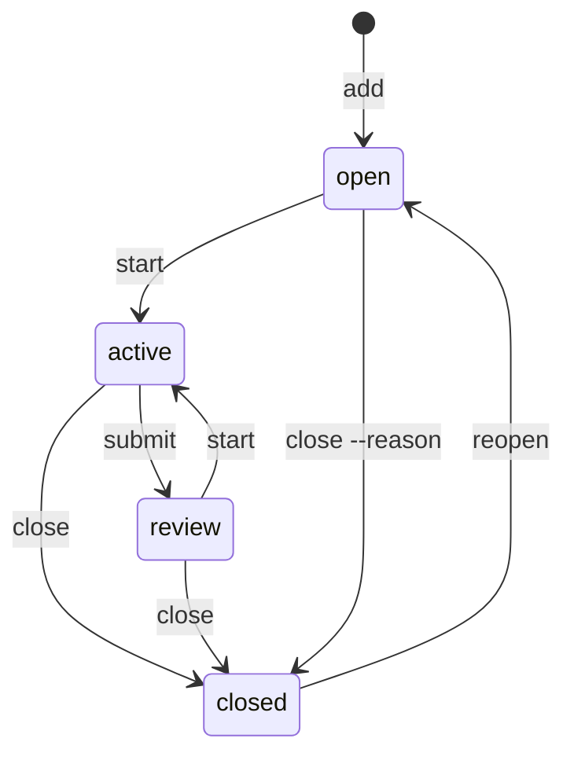

Use a Task for work you can finish and verify. Its log records progress; its dependencies determine when it is ready. Change its state with lifecycle commands.

## The lifecycle



`start` moves a Task into active work and records who holds it as `taken-by`. A Task someone else holds is refused with `taken`; `anb add task --taken-by <name>` assigns it at creation and `anb edit <id> --taken-by <name>` reassigns it later. Use `submit --to <name>` when the result needs that person's acceptance, then `close` to accept it or `start` to continue work. Resuming clears the review recipient, so the next review needs a new handoff. Review is optional; you can close directly from active. `reopen` returns a closed Task to open, clears the previous review recipient and preserves the recorded outcomes.

An invalid move returns `invalid-transition` with valid next commands. For example, an open Task cannot enter review: start the work first, or close it with `--reason` if it is no longer needed. The [refusal reference](../reference/refusals.md) shows the structured replies.

## Continuing across sessions

`anb start --next` selects and starts one eligible Task under the same command lock. It prefers work assigned to you, then untaken work. It never takes a colleague's Task. Add `--for <id>` to select only the subject and its transitive origin descendants. Dependencies and contextual links do not make a record part of that work. Readiness still uses the complete dependency graph, including work assigned to colleagues.

A session remembers one Task. The CLI uses `--session <id>`, then `ANB_SESSION`, then the agent's `CODEX_THREAD_ID`. Once a Task is remembered, `anb start` resumes it and `anb recall` opens its context. `start --next` also resumes that Task while it remains active and unheld; after you close, hold or submit it, the command selects the next eligible Task. To switch before then, name the other Task explicitly.

Two sessions can work on different Tasks for the same person. A second session starting the same Task receives `session-conflict`; use `anb start <id> --join` only when both sessions are meant to work together. Joining keeps the first session's focus. Human ownership remains `taken-by`, so joining does not bypass a colleague's ownership. Without a session id, multiple active Tasks remain visible and no Task is chosen as the current focus.

Session state lives in ignored `.sessions.tmp/` files beside the notebook. It coordinates commands using that notebook root, not separate clones or remote worktrees. It has no timeout and does not infer whether another agent is alive. The Markdown records remain the shared memory; a session id never enters their frontmatter.

An interrupted start leaves a recoverable local intent. Retry `anb start --session <id>` to finish the same Task change. If the Task was edited in between, the CLI returns `session-recovery` without overwriting it. Preserve the session file and inspect both versions before recovering; a reader never repairs local state as a side effect.

## Recording the outcome

Record the result where the next reader will look: on the Task. Use `--body` for a short outcome or `--body-file` for Markdown from a file. Say what changed, how it was checked and where the evidence can be found. Closing writes the outcome and the state together; it does not require a separate report Note.

| Flag | Outcome |
|---|---|
| `--body "<outcome>"` | an attributed outcome appended to the Task |
| `--body-file <file>` | the same outcome read from a file; `-` reads standard input |
| `--reason "<why>"` | a reason to end work without completing it; also allowed from open |

```sh
anb close task.parser-accepts-fenced-bodies --body "Nested and indented fences parse correctly. The parser and byte-preservation tests pass."
```

Cite a pull request, commit or external report in the outcome. If a finding deserves independent maintenance, create a Note with `anb add note --from <task>` and link it where needed. Choose one closing option. `--via <tool>` attributes an outcome supplied with `--body` or `--body-file`.

The reply lists newly unblocked Tasks and any Questions still open from this Task. Resolve those Questions or record why they remain open. Then run `anb archive <id>` to archive that Task. Linked knowledge keeps its own lifecycle. The body and id are preserved. Repeating a close does not append or replace its outcome; use `comment` to add a correction before archiving.

The tool records evidence; it does not evaluate its quality. Write the outcome for someone who did not see the work happen.

## Holds

Use a hold when work must pause for a reason that is not another Task:

```sh
anb hold task.negative-corpus-wired-into-ci --reason "Waiting for the corpus license."
```

`--until <date>` records the intended resumption date. It does not lift the hold automatically: run `anb unhold <id>` when work can resume. Held Tasks leave the ready queue and the `active:` display. Status lists them under `held` when it prints a full summary, and stale holds become [Debt](../reference/status.md#debt).

Run `hold` again to change the reason or date without briefly making the Task ready. Omitting `--until` removes a previous date. An identical reason and date leave the record unchanged.

## Dependencies

`anb block <id> <on>` makes the first Task wait on the second. The tool rejects an edge that would create a cycle and prints the cycle in the refusal. `anb unblock <id> <on>` removes the dependency.

A dependency stops blocking when its Task closes. The edge remains as a record of the relationship. You can start a Task to accept responsibility while its dependencies are unfinished, but successful completion waits for them. A refused close names the unfinished prerequisites and offers commands to inspect them. Cancellation with `--reason` remains possible without closing or changing those prerequisites. When the last dependency closes, the reply names the Task it unblocked.

## Hubs and epics

Use a hub when an outcome spans several independently verifiable Tasks. An [idea](ideas.md) can retain the wider proposal when it needs its own home, but it is not a prerequisite for creating work. Create each child `--from` the hub, then make the hub depend on it. The origin records why the child exists; the dependency records what must finish before the hub can close. These examples choose explicit IDs; ordinary `add` returns the allocated ID to use in later commands:

```sh
anb add task "Ship the parser" --id task.ship-the-parser --tag epic
anb add task "Negative corpus wired into CI" --id task.negative-corpus-wired-into-ci --from task.ship-the-parser
anb block task.ship-the-parser task.negative-corpus-wired-into-ci
```

A child Task should produce one independently reviewable result. Add dependencies between children when one needs another's result; a shared topic alone does not create that dependency. Cite the spec and relevant model or Decisions in Task bodies so another session can read their context.

You can use your own grouping convention; the automatic epic summary recognizes a hub by that pair of relationships: it depends on a Task whose origin points back to it. The `epic` tag helps you find the hub; it does not establish membership. If you missed an origin when creating a child, set it with `anb edit <id> --from <hub>`.

`anb ready --for <hub>` is the epic's own queue and `anb list --for <hub>` its live membership, following `from` through nested work; `--archive` adds the children already filed. External prerequisites can block that queue without joining it. Use `graph --focus <hub>` or `recall --for <hub>` for the wider context. A hub's node in `anb graph` carries how many of its direct dependencies are closed and the next ready Task in its scope. Once all dependencies close, the hub becomes ready for acceptance. Close and archive it when the overall result is complete.

## Correcting a record

Use `anb edit <id>` to correct a title, body, tags, links, origin, priority, `taken-by` or `review-by` date. `--clear` removes an optional field supported by that flag. Lifecycle commands change state. If the record has error findings, use the repair commands reported by `anb check`. A repair may leave other errors: it must remove some of the record's errors without introducing new ones. Run `check` again to see what remains. A `-` in the repair column means the CLI has no repair for that finding.

A link to a missing record blocks unrelated edits and lifecycle changes. Remove the broken relation with `anb edit <id> --unlink "<kind> <target>"`, or create its missing target. A record in a personal notebook cannot satisfy a shared relation: the same files must validate for every collaborator.

To resume archived work, run `anb restore <id>` first, then `anb reopen <id>`. Restore changes where the file lives; reopen changes its state.
