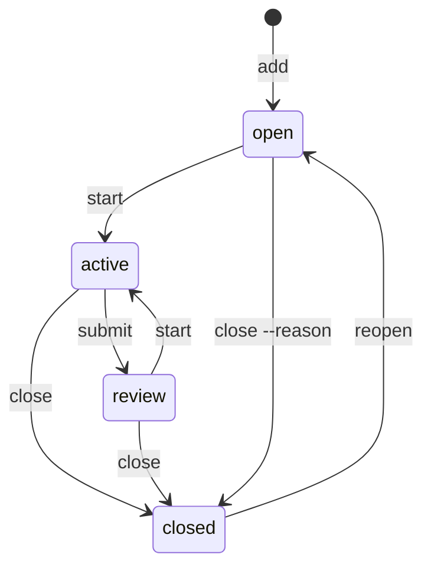

Use a Task for work you can finish and verify. Its log records progress; its dependencies determine when it is ready. Change its state with lifecycle commands.

## The lifecycle



`start` moves a Task into active work and records who took it as `taken-by`. A Task someone else took is refused with `taken`; `anb edit <id> --taken-by <name>` hands it over. Use `submit` when the result needs human acceptance, then `close` to accept it or `start` to continue work. Review is optional; you can close directly from active. `reopen` returns a closed Task to open and logs the transition. The CLI refuses an invalid move and lists valid alternatives:

```
$ anb submit task.ship-the-parser
error[invalid-transition]: `task.ship-the-parser` is open; valid: start, close --reason
try: anb start task.ship-the-parser
try: anb close task.ship-the-parser --reason "<why>"
```

## Closing with a proof

Choose a proof that lets a later reader assess the result. `--note` is the recommended workflow because it imports the report into the notebook. You must pass the flag explicitly; the CLI does not select a proof for you.

| Flag | Proof |
|---|---|
| `--note <file>` | a report imported as a Note and linked to the Task |
| `--pr <url>` | a pull request containing the work |
| `--sha <sha>` | a commit containing the work |
| `--report <path>` | a path to a report maintained outside the notebook |
| `--no-proof` | an explicit statement that there is no proof |
| `--reason "<why>"` | a reason to end work without completing it; also allowed from open |

```
$ anb close task.parser-accepts-fenced-bodies --note report.md
ok: close task.parser-accepts-fenced-bodies — active→closed
report: note.report-parser-accepts-fenced-bodies
```

The report's id is `note.report-` followed by the Task's own slug, so a reader can name it from the Task; a second report on the same Task, after a reopen, takes a collision suffix. The reply lists newly unblocked Tasks and any Questions still open from this Task. Resolve those Questions or record why they remain open. Then run `anb archive <id>` to move the Task and its report Notes into the archive. The log and ids are preserved.

The tool records evidence; it does not evaluate its quality. Write the report for someone who did not see the work happen.

## Holds

Use a hold when work must pause for a reason that is not another Task:

```
$ anb hold task.negative-corpus-wired-into-ci --reason "waits for the corpus license"
ok: hold task.negative-corpus-wired-into-ci — held
```

`--until <date>` records the intended resumption date. It does not lift the hold automatically: run `anb unhold <id>` when work can resume. Held Tasks leave the ready queue and the `active:` display. Status lists them under `held` when it prints a full summary, and stale holds become [Debt](../reference/status.md#debt).

## Dependencies

`anb block <id> <on>` makes the first Task wait on the second. The tool rejects an edge that would create a cycle and prints the cycle in the refusal. `anb unblock <id> <on>` removes the dependency.

A dependency stops blocking when its Task closes. The edge remains as a record of the relationship. When the last dependency closes, the reply names the Task it unblocked.

## Hubs and epics

The supplied workflow develops a new request as an [idea](ideas.md) before treating it as delivery work. When larger work is ready to be decomposed, create a hub Task from the idea and child Tasks from the hub. Create each child `--from` the hub, then make the hub depend on it. The origin records why the child exists; the dependency records what must finish before the hub can close:

```
$ anb add task "Ship the parser" --tag epic
ok: add task.ship-the-parser — tasks/task.ship-the-parser.md

$ anb add task "Negative corpus wired into CI" --from task.ship-the-parser
ok: add task.negative-corpus-wired-into-ci — tasks/task.negative-corpus-wired-into-ci.md

$ anb block task.ship-the-parser task.negative-corpus-wired-into-ci
ok: block task.ship-the-parser — waits on task.negative-corpus-wired-into-ci
```

A child Task should produce one independently reviewable result. Add dependencies between children when one needs another's result; a shared topic alone does not create that dependency. Cite the spec and relevant model or Decisions in Task bodies so another session can read their context.

You can use your own grouping convention; the automatic epic summary recognizes a hub by that pair of relationships: it depends on a Task whose origin points back to it. The `epic` tag helps you find the hub; it does not establish membership. If you missed an origin when creating a child, set it with `anb edit <id> --from <hub>`.

`anb ready --for <hub>` is the epic's own queue and `anb list --for <hub>` its live membership, nested work included; `--archive` adds the children already filed. A hub's node in `anb graph` carries how many of its direct dependencies are closed and the next ready Task in its scope. Once all dependencies close, the hub becomes ready for acceptance. Close and archive it when the overall result is complete.

## Correcting a record

Use `anb edit <id>` to correct a title, body, tags, links, origin, priority, `taken-by` or `review-by` date. `--clear` removes an optional field supported by that flag. Lifecycle commands change state. If the record has error findings, use the repair commands reported by `anb check`. A repair may leave other errors: it must remove some of the record's errors without introducing new ones. Run `check` again to see what remains. A `-` in the repair column means the CLI has no repair for that finding.

To resume archived work, run `anb restore <id>` first, then `anb reopen <id>`. Restore changes where the file lives; reopen changes its state.
