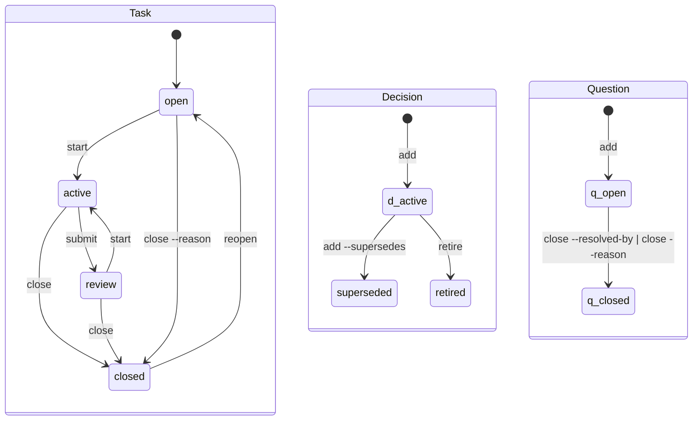

## The file

A record is one markdown file: a `---`-fenced envelope of single-line `key: value` fields the tool owns, then a body the tool never parses.

```markdown
---
id: task.parser-accepts-fenced-bodies
type: task
state: closed
title: Parser accepts fenced bodies
by: Alex
tags: parser
link: note note.report-parser-accepts-fenced-bodies
created: 2026-09-05
updated: 2026-09-05
closed: 2026-09-05
---
- 2026-09-05 Alex: fences parse; the indented-body case is next
```

The envelope looks like YAML frontmatter and is not YAML: each value is typed by its key, never guessed from its shape, so `state: no` cannot become a boolean. Parsing is total: any input parses into a file whose rendering reproduces the input byte for byte, and what the grammar cannot accept becomes a named finding rather than a dropped byte. A Task's body is its log, one line per entry; every other body is prose.

## Envelope keys

| Key | Form | On | Written by |
|---|---|---|---|
| `id` | `<type>.<slug>` | every record, required | `add`, minted from the title or given with `--id` |
| `type` | `task`, `decision`, `note`, `question` | required | `add` |
| `state` | see the lifecycles below | required | the lifecycle commands |
| `kind` | a Decision's `rule`, `shape`, `drift`; a Note's `fact`, `term`, `guide` | Decision, Note | `add --kind` |
| `title` | text | required | `add`, `edit --title` |
| `by` | text | any | `add`, from the git identity, or `--by` |
| `via` | text | any | `add --via`, `comment --via`: the acting agent tool |
| `from` | an id | any | `add --from`, `edit --from`: the origin |
| `tags` | `[a-z0-9-]+`, comma-separated | any | `add --tag`, `edit --tag`, `edit --untag` |
| `link` | `<kind> <target>`, repeatable | any | `add --link`, `close --note`, `--pr`, `--sha`, `--report` |
| `supersedes`, `superseded-by` | an id | Decision, Note | `add --supersedes`, both sides at once |
| `blocked-by` | an id, repeatable | Task | `block`, `unblock` |
| `resolved-by` | an id | Question | `close --resolved-by` |
| `reason` | text | Task, Question | `close --reason` |
| `priority` | `0` to `4`, `0` the most urgent | Task | `add --priority`, `edit --priority` |
| `hold`, `hold-until` | text; a date | Task | `hold --reason`, `hold --until`; `unhold` erases both |
| `created`, `updated`, `closed` | dates | `created` required | the tool, on every write |
| `review-by` | a date | any | `edit --review-by`: the explicit resurfacing date |

A key on a type it does not belong to is an `orphan-field` finding. Dates mean notebook time: the day the tool wrote the line.

## The lifecycles



A Note has two states, `active` and `retired`: `retire` ends it, and a successor added with `--supersedes` retires it too, writing `superseded-by` on the old one. A Task also carries two computed conditions the state does not: **held**, while a `hold` line stands, and **blocked**, while any Task it waits on is not closed. `ready` is open, unblocked and unheld.

Closing carries one of seven: `--note`, `--pr`, `--sha`, `--report`, `--no-proof`, `--reason`, or for a Question `--resolved-by`. A close with none is refused; the message names all seven and the `try:` lines offer the three most common.

## Ids

An id is `<type>.<slug>`, the slug `[a-z0-9-]+`, minted from the title and shortened to whole words. Ids are unique across the working set and the archive, and never reused by a lifecycle move; only `delete`, for a record born by mistake, frees one.

## The layout

```
.agent-notebook/
  config              optional; the same line grammar, keys below
  .gitignore          written by the tool: the lock and temporary files
  tasks/              one <id>.md per live record
  decisions/
  notes/
  questions/
  archive/
    tasks/            settled records, same filename, same bytes
    decisions/
    notes/
    questions/
```

`archive` moves a settled record into `archive/<type>/` and carries the report Notes linked to it; `restore` moves it back. A live record found in the archive, or a settled one left live, is a check finding, and the finding names the move that repairs it.

## Configuration

`.agent-notebook/config` holds `key: value` lines; every key has a default, and a line the tool cannot read falls back to it with a warning in `check`.

| Key | Default | Meaning |
|---|---|---|
| `format` | `1` | the version of the format the notebook is written in |
| `budget` | `1500` | the Status token ceiling; `0` lifts it |
| `debt-task-stale` | `7` | days an active Task may go without a log entry |
| `debt-question-age` | `14` | days a free-standing Question may stay open |
| `debt-question-age-task-born` | `7` | the same for a Question born from a Task |
| `debt-hold-stale` | `14` | days a hold may stand |
| `debt-review-stale` | `7` | days a Task may wait in review |
