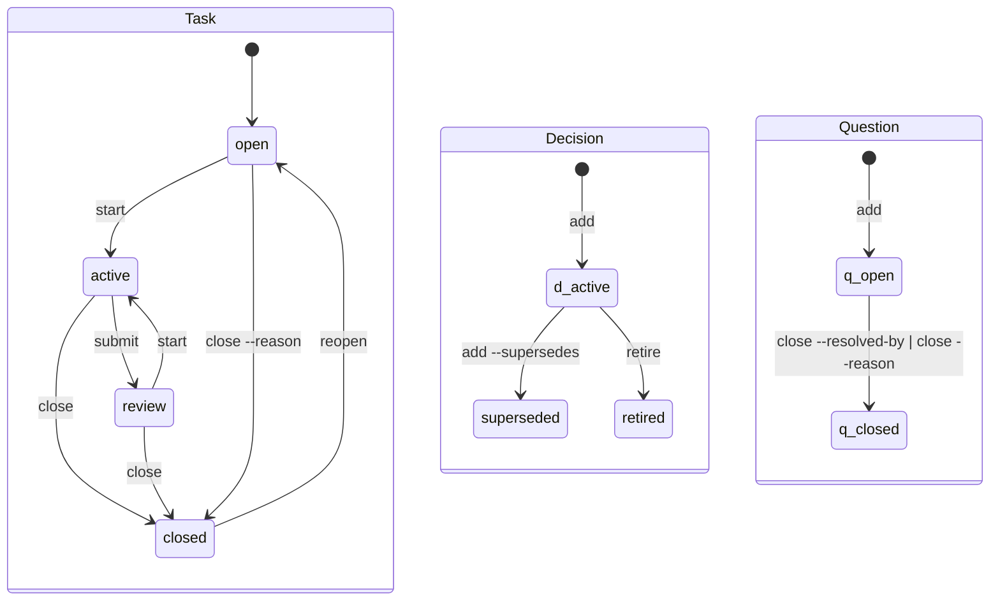

## The file

Each record is a Markdown file with a `---`-fenced envelope of single-line `key: value` fields followed by a body. The envelope stores state and relationships; the body contains prose and log entries.

```markdown
---
id: task.parser-accepts-fenced-bodies
type: task
state: closed
title: Parser accepts fenced bodies
by: Alex
tags: parser
link: note note.report-parser-accepts-fenced-bodies
created: 2026-09-05
updated: 2026-09-05
closed: 2026-09-05
---
- 2026-09-05 Alex: fences parse; the indented-body case is next
```

The envelope uses its own line grammar, not YAML. Each key defines the allowed value; `state: no` is an invalid state, not a boolean. Parsing and rendering unchanged input preserves its bytes, including malformed lines. Validation reports those lines as findings instead of discarding them.

Commands update the fields they own. The grammar preserves the body as text; separate queries scan it for record mentions and the latest Task log entry. Use `anb` to change records, and run `anb check` after an external edit or merge.

## Envelope keys

| Key | Form | On | Written by |
|---|---|---|---|
| `id` | `<type>.<slug>` | every record, required | `add`, minted from the title or given with `--id` |
| `type` | `task`, `decision`, `note`, `question` | required | `add` |
| `state` | see the lifecycles below | required | the lifecycle commands |
| `kind` | a Decision's `rule`, `shape`, `drift`; a Note's `fact`, `term`, `guide`, `idea`, `model`, `spec` | Decision, Note | `add --kind` |
| `title` | text | required | `add`, `edit --title` |
| `by` | text | any | `add`, from the git identity, or `--by` |
| `via` | text | any | `add --via`: the creating agent tool; `comment --via` labels a log entry without changing this field |
| `from` | an id | any | `add --from`, `edit --from`: the origin |
| `tags` | `[a-z0-9-]+`, comma-separated | any | `add --tag`, `edit --tag`, `edit --untag` |
| `link` | `<kind> <target>`, repeatable | any | `add --link`, `close --note`, `--pr`, `--sha`, `--report` |
| `supersedes`, `superseded-by` | an id | Decision, Note | `add --supersedes`, both sides at once |
| `blocked-by` | an id, repeatable | Task | `block`, `unblock` |
| `resolved-by` | an id | Question | `close --resolved-by` |
| `reason` | text | Task, Question | `close --reason` |
| `priority` | `0` to `4`, `0` the most urgent | Task | `add --priority`, `edit --priority` |
| `hold`, `hold-until` | text; a date | Task | `hold --reason`, `hold --until`; `unhold` erases both |
| `created`, `updated`, `closed` | dates | `created` required | the tool, on every write |
| `review-by` | a date | any | `edit --review-by`: the explicit resurfacing date |

The `idea`, `model` and `spec` kinds extend the Note vocabulary without changing its lifecycle or existing files. Older binaries reject these kinds, so every agent using the notebook needs a CLI that supports them before they are added.

A key on a type it does not belong to is an `orphan-field` finding. Creation, update and closure dates record when the notebook learned or changed something. Put dates from project history in the body. Scheduling fields such as `review-by` and `hold-until` name future actions.

## The lifecycles



Notes are `active` or `retired`. `retire` ends a Note; adding a successor with `--supersedes` also retires the predecessor and writes its `superseded-by` field.

Tasks can be held or blocked independently of their lifecycle state. A `hold` field makes a Task held; an unresolved dependency makes it blocked. `ready` selects open Tasks that are neither held nor blocked.

Closing a completed Task requires `--note`, `--pr`, `--sha`, `--report` or `--no-proof`. `--reason` ends a Task without completing it, including from open. Questions close with `--resolved-by` or `--reason`. See [Tasks](../guides/tasks.md#closing-with-a-proof) for proof selection.

## Ids

Ids use `<type>.<slug>`, with a slug matching `[a-z0-9-]+`. `add` derives one from the title and shortens it at word boundaries, or accepts an explicit `--id`. Ids are unique across the working set and archive. Lifecycle moves preserve them; `delete` frees the id of a record created by mistake.

## The layout

```
.agent-notebook/
  config              optional; the same line grammar, keys below
  .gitignore          written by the tool: the lock and temporary files
  tasks/              one <id>.md per live record
  decisions/
  notes/
  questions/
  archive/
    tasks/            settled records, same filename, same bytes
    decisions/
    notes/
    questions/
```

`archive` moves a settled record into the corresponding directory under `archive/` and archives its linked report Notes. `restore` returns an archived record to the working set without changing its state. `check` reports a mismatch between state and location and names the appropriate move.

## Configuration

`.agent-notebook/config` uses `key: value` lines. Omitted settings use the defaults below. Invalid settings produce warnings in `check` and fall back to their defaults.

| Key | Default | Meaning |
|---|---|---|
| `format` | `1` | the version of the format the notebook is written in |
| `budget` | `1500` | the estimated Status token budget; `0` disables budget-driven cuts; [limits](status.md#the-budget) still apply |
| `debt-task-stale` | `7` | days an active Task may go without a log entry |
| `debt-question-age` | `14` | days a free-standing Question may stay open |
| `debt-question-age-task-born` | `7` | the same for a Question born from a Task |
| `debt-hold-stale` | `14` | days a hold may stand |
| `debt-review-stale` | `7` | days a Task may wait in review |
