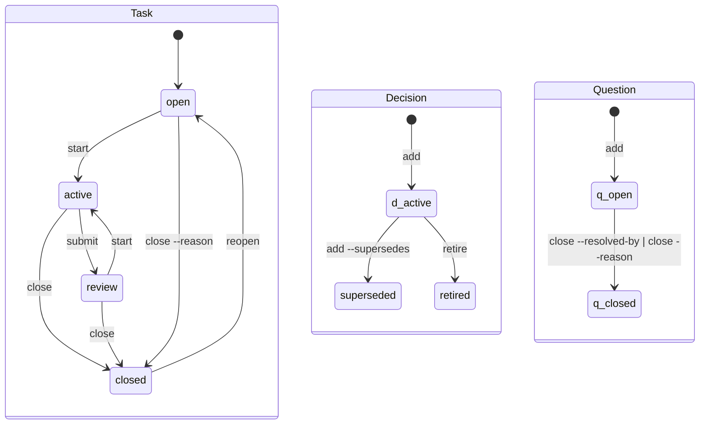

## The file

Each record is a Markdown file with a `---`-fenced YAML envelope followed by a body. The envelope stores state and relationships; the body contains prose and log entries.

```markdown
---
id: task.parser-accepts-fenced-bodies
type: task
state: closed
title: Parser accepts fenced bodies
by: Alex
taken-by: Alex
tags: parser
link: pr https://example.com/pull/7
created: 2026-09-05
updated: 2026-09-05
closed: 2026-09-05
---
- 2026-09-05 Alex: Fenced bodies parse correctly; parser and migration checks pass.
```

The envelope is a flat mapping. Values are single-line scalars; repeated values use a block sequence. The writer quotes text when YAML could mistake punctuation or words such as `null` for structure or another type. Each key still defines its allowed value: `state: "no"` is an invalid state. The reader accepts plain values, JSON-compatible double-quoted values and single-quoted values with doubled internal quotes. It does not interpret inline comments, flow collections or aliases: legacy plain values remain literal text. Nested mappings and multiline scalars are outside the record format.

```yaml
title: "Report: preserve the evidence"
link:
  - doc https://example.com/spec
  - note note.evidence
```

Older files with unquoted punctuation or repeated keys remain readable. Reading preserves the original bytes, including malformed lines; validation reports those lines instead of discarding them. An actual mutation writes a canonical YAML envelope and preserves unknown fields and the unchanged body. A no-op leaves the file untouched. `migrate --check` previews envelope changes across the working set and archive; `migrate` applies them with recoverable originals.

One old spelling is ambiguous: the former line grammar treated surrounding quotes as literal characters, while YAML treats them as delimiters. `title: "A quoted name"` now reads as `A quoted name`. If the quotes belong to the title, write `title: "\"A quoted name\""`. The reader does not guess which convention a file used. Review these values before migrating; the migration journal preserves their exact original bytes.

Commands update the fields they own. The grammar preserves the body as text; separate queries scan it for record mentions and the latest Task log entry. Use `anb` to change records, and run `anb check` after an external edit or merge.

## Envelope keys

| Key | Form | On | Written by |
|---|---|---|---|
| `id` | `<type>.<slug>` | every record, required | `add`, randomly generated or given with `--id`; `import` preserves the source id |
| `type` | `task`, `decision`, `note`, `question` | required | `add` |
| `state` | see the lifecycles below | required | the lifecycle commands |
| `kind` | a Decision's `rule`, `shape`, `drift`; a Note's `fact`, `term`, `guide`, `idea`, `model`, `spec` | Decision, Note | `add --kind` |
| `title` | text | required | `add`, `edit --title` |
| `by` | text | any | `add`, from the identity (`ANB_BY`, else the git `user.name`), or `--by` |
| `via` | text | any | `add --via`: the creating agent tool; `comment --via` signs a log entry `by/via` without changing this field |
| `taken-by` | text | Task | who holds the Task: `start`, from the identity, when the Task has none; `add --taken-by` or `add --mine` hands it over as it is written, `edit --taken-by` later; `edit --clear taken-by` erases it |
| `to` | text | Task, Question | whom the record is addressed to: `add --to`, `submit --to`, `edit --to`; `edit --clear to` erases it |
| `from` | an id | any | `add --from`, `edit --from`: the origin |
| `tags` | `[a-z0-9-]+`, comma-separated | any | `add --tag`, `edit --tag`, `edit --untag` |
| `link` | `<kind> <target>`, repeatable; a target shaped like an id names a record and forms an edge under the link's kind, see [relations](#relations) | any | `add --link`, `edit --link`, `edit --unlink` |
| `supersedes`, `superseded-by` | an id | Decision, Note | `add --supersedes`, both sides at once |
| `blocked-by` | an id, repeatable | Task | `block`, `unblock` |
| `resolved-by` | an id | Question | `close --resolved-by` |
| `reason` | text | Task, Question | `close --reason` |
| `priority` | `0` to `4`, `0` the most urgent | Task | `add --priority`, `edit --priority` |
| `hold`, `hold-until` | text; a date | Task | `hold --reason`, `hold --until`; `unhold` erases both |
| `created`, `updated`, `closed` | dates | `created` required | `add` sets creation; mutations set update and lifecycle dates; `import` preserves supplied dates |
| `review-by` | a date | any | `edit --review-by`: the explicit resurfacing date |

The `idea`, `model` and `spec` kinds extend the Note vocabulary without changing its lifecycle or existing files. Older binaries reject these kinds, so every agent using the notebook needs a CLI that supports them before they are added.

A key on a type it does not belong to is an `orphan-field` finding. Creation, update and closure dates describe the record's history, including source dates preserved by an import. Put the source and any uncertainty about those dates in the body or a source link. Scheduling fields such as `review-by` and `hold-until` name future actions.

## The lifecycles



Notes are `active` or `retired`. `retire` ends a Note; adding a successor with `--supersedes` also retires the predecessor and writes its `superseded-by` field.

Tasks can be held or blocked independently of their lifecycle state. A `hold` field makes a Task held; an unresolved dependency makes it blocked. `ready` selects open Tasks that are neither held nor blocked.

A Task belongs to whoever holds it, named by `taken-by`; `by` is the author and a different fact. `start` records who took it as `taken-by` when the Task has none, and refuses a Task someone else holds with `taken`; `add --taken-by` hands a Task over as it is written and `edit --taken-by` later. A Task nobody holds is nobody's, whoever wrote it.

A record waits on the person `to` names while it waits at all: an open Question, or a Task in review. `start` clears the recipient when it takes a Task back from review; a new review needs its own handoff. Closing preserves the recipient as history, but a settled record waits on nobody. `reopen` clears the previous review recipient before the next work cycle. `add question --to` puts a doubt to someone, `submit --to` hands a review to someone, and `edit --to` corrects either. A Task may also name its intended reviewer before its first submission.

Closing a completed Task requires an outcome with `--body` or `--body-file`. The attributed outcome and state are written together on the Task. Cite evidence in the outcome or add typed links with `edit --link`. `--reason` ends a Task without completing it, including from open. Questions close with `--resolved-by` or `--reason`. See [Tasks](../guides/tasks.md#recording-the-outcome).

`comment` appends an attributed entry to every record type. `retire --body` and `retire --body-file` append an outcome while retiring a Note or Decision. Multiline entries indent their continuation lines under the dated signature. These operations preserve existing body text and creation attribution.

## Relations

Envelope references, including record-shaped `link` targets, resolve within the same notebook. A shared record cannot depend on a private notebook installed on one reader's machine. Use a source URL or explain private context in the body when it matters to the shared record.

Links, tags and mentions describe relationships; they do not prove agreement or conflict. The CLI does not infer contradictions from them. Checks, work queries and write-time hints use only the selected notebook. `recall` can present project knowledge and personal practices together, with each source's audience explicit.

A record relates to another through its envelope or its body. `from` is the origin: why the record exists. `blocked-by` is a dependency: what must close first. A record-shaped `link` target declares a relationship under its own kind, such as `schema`, `within` or `departs-from`. Link kinds cannot use the graph's reserved words: `waits`, `born` and `mentions`. A record cannot link itself. A bare id in the body is a mention; ids inside backticks or backtick-fenced code blocks are quotations, not relationships.

`show` lists mentions and inbound relationships. The graph draws dependencies, origins, typed links and body mentions. `graph --focus <id> --depth <n>` follows those edges in either direction, counting the shortest path: records with a shared origin are two edges apart. The map's arrows retain their meaning. `recall --for <id>` uses this neighbourhood to prioritize knowledge without hiding unrelated standing rules. An explicit archived focus contributes its relationships, but recall still returns only live Notes and Decisions; it does not open the rest of the archive. Membership queries such as `list --for <id>`, `ready --for <id>` and `graph --for <id>` select the subject and its transitive origin descendants. Dependencies and contextual links do not declare membership; readiness still uses the complete dependency graph. Lifecycle pointers `supersedes`, `superseded-by` and `resolved-by` are validated but are not graph edges.

## Ids

Ids use `<type>.<slug>`, with a slug matching `[a-z0-9-]+`. The CLI generates 128 bits from the operating system's random source and encodes them as 32 hexadecimal characters after the type prefix. Independent sessions and clones do not need a shared counter or a unique title. An explicit `--id` and an imported source id remain unchanged. Ids are unique across the working set and archive. Lifecycle moves preserve them; `delete` frees the id of a record created by mistake.

The Core library accepts ids supplied by its host. A `Draft` without an id uses a deterministic local title-based fallback; embedded hosts creating records across independent replicas should supply random ids as the CLI does.

## The layout

```
.agent-notebook/
  config              optional; key: value lines, keys below
  .gitignore          written by the tool: the lock and temporary files
  tasks/              one <id>.md per live record
  decisions/
  notes/
  questions/
  archive/
    tasks/            settled records, same filename, same bytes
    decisions/
    notes/
    questions/
```

`archive` moves only the named settled record into the corresponding directory under `archive/`, without rewriting its bytes. Linked Notes keep their state and location, including Notes created from that record. Retire and archive a Note explicitly when its knowledge is no longer current. `restore` returns only the named archived record to the working set without changing its state. `check` reports a mismatch between state and location and names the appropriate move.

An interrupted move may leave a file in both locations. `archive` and `restore` resume only when those copies are byte-identical; different bytes produce `duplicate-id` and both files stay untouched, even when they declare the same id. A later correction or a Git merge may have changed either copy. Preserve both originals, compare and reconcile their contents, then leave the intended record in the appropriate location. Do not use `delete` to resolve this conflict: it removes every copy of the id. Run `check` after reconciliation.

## Import and migration

`anb import <directory> --check` previews importing a directory with this layout. It checks the prospective notebook, including links from incoming records to existing records, without writing anything. `anb import <directory>` adds the files with canonical envelopes. It preserves ids, recorded dates, authors, unknown fields, bodies and archive locations; it does not copy source configuration. Identical records are skipped. A conflicting id, an invalid record or an unresolved relationship refuses the whole plan before any record is written. If storage fails partway through, retry the same import: files already added are skipped and existing records are never overwritten.

`anb migrate --check` previews envelope normalization without creating a backup or changing a file. `anb migrate` first saves every original in `.migrations.tmp/<number>.json`, outside the typed record directories, then replaces each envelope atomically. The journal maps relative file paths to their complete original text. It is kept after success, with a `.done` marker beside it; the notebook's standard `*.tmp` ignore excludes its directory from Git.

An interrupted migration resumes from that journal. It accepts only files still equal to their original or planned form and refuses a later edit instead of overwriting it. Keep the journal until you have reviewed the migration. To recover a file, read its original text from the corresponding JSON entry; restore that text to the named relative path. Migration changes no record dates or body bytes, including in the archive.

The filesystem adapter syncs each temporary file before renaming it into place and preserves the target's file permissions. On Unix it also syncs the containing directory and newly created parent entries. Other platforms sync file contents without a directory-durability guarantee. A sync failure can be reported after a rename has become visible, so a failed command does not mean that no file changed. Recovery checks the actual bytes before continuing. These guarantees depend on the filesystem and operating system honoring their sync operations; process-interruption tests do not prove behavior under power loss.

## Configuration

`.agent-notebook/config` uses `key: value` lines. Omitted settings use the defaults below. Invalid settings produce warnings in `check` and fall back to their defaults.

| Key | Default | Meaning |
|---|---|---|
| `format` | `1` | the version of the format the notebook is written in |
| `budget` | `1500` | the estimated Status token budget; `0` disables budget-driven cuts; [limits](status.md#the-budget) still apply |
| `scope` | `team` | whose records a read answers with when the call names nobody: `team` for everyone's, `mine` for the Tasks the identity holds, the records it wrote and the records waiting on it; `--team`, `--mine`, `--by` and `--untaken` outrank it for one call |
| `debt-task-stale` | `7` | days an active Task may go without a log entry |
| `debt-question-age` | `14` | days a free-standing Question may stay open |
| `debt-question-age-task-born` | `7` | the same for a Question born from a Task |
| `debt-hold-stale` | `14` | days a hold may stand |
| `debt-review-stale` | `7` | days a Task may wait in review |

The work sections of `recall`, the automatic context hook, `status`, `list` and `ready` use the configured `scope`; without that setting they show team work. Explicit audience flags override it where available. With `scope: mine`, use `--team` to discover an unassigned subject or a colleague's work.

Knowledge reads stay shared. Recall's Notes and Decisions ignore the default `scope: mine`, as do `--kind` queries and `--type` queries containing only Notes and Decisions. Explicit `--mine` or `--by` narrows a listing to one person's records, but in recall it narrows only work. Authorship identifies a source; it does not limit who should learn a project rule.
