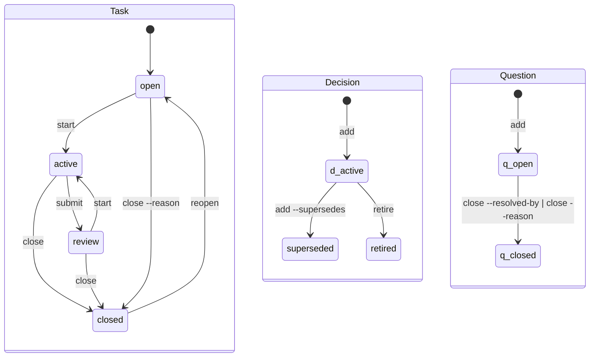

## The file

Each record is a Markdown file with a `---`-fenced YAML envelope followed by a body. The envelope stores state and relationships; the body contains prose and log entries.

```markdown
---
id: task.parser-accepts-fenced-bodies
type: task
state: closed
title: Parser accepts fenced bodies
by: Alex
taken-by: Alex
tags: parser
link: pr https://example.com/pull/7
created: 2026-09-05
updated: 2026-09-05
closed: 2026-09-05
---
- 2026-09-05 Alex: Fenced bodies parse correctly; parser and migration checks pass.
```

The envelope is a flat mapping. Values are single-line scalars; repeated values use a block sequence. The writer quotes text when YAML could mistake punctuation or words such as `null` for structure or another type. Each key still defines its allowed value: `state: "no"` is an invalid state. The reader accepts plain values, JSON-compatible double-quoted values and single-quoted values with doubled internal quotes. It does not interpret inline comments, flow collections or aliases: legacy plain values remain literal text. Nested mappings and multiline scalars are outside the record format.

```yaml
title: "Report: preserve the evidence"
link:
  - doc https://example.com/spec
  - note note.evidence
```

Older files with unquoted punctuation or repeated keys remain readable. Reading preserves the original bytes, including malformed lines; validation reports those lines instead of discarding them. An actual mutation writes a canonical YAML envelope and preserves unknown fields and the unchanged body. A no-op leaves the file untouched. `migrate --check` previews envelope changes across the working set and archive; `migrate` applies them with recoverable originals.

One old spelling is ambiguous: the former line grammar treated surrounding quotes as literal characters, while YAML treats them as delimiters. `title: "A quoted name"` now reads as `A quoted name`. If the quotes belong to the title, write `title: "\"A quoted name\""`. The reader does not guess which convention a file used. Review these values before migrating; the migration journal preserves their exact original bytes.

Commands update the fields they own. The grammar preserves the body as text; separate queries scan it for record mentions and the latest Task log entry. Use `anb` to change records, and run `anb check` after an external edit or merge.

## Envelope keys

| Key | Form | On | Written by |
|---|---|---|---|
| `id` | `<type>.<slug>` | every record, required | `add`, derived from the title or given with `--id`; `import` preserves the source id |
| `type` | `task`, `decision`, `note`, `question` | required | `add` |
| `state` | see the lifecycles below | required | the lifecycle commands |
| `kind` | a Decision's `rule`, `shape`, `drift`; a Note's `fact`, `term`, `guide`, `idea`, `model`, `spec` | Decision, Note | `add --kind`, `edit --kind` |
| `title` | text | required | `add`, `edit --title` |
| `by` | text | any | `add`, from the identity (`ANB_BY`, else the git `user.name`), or `--by` |
| `via` | text | any | `add --via`: the creating agent tool; `comment --via` signs a log entry `by/via` without changing this field |
| `taken-by` | text | Task | who holds the Task: `start`, from the identity, when the Task has none; `add --taken-by` or `add --mine` hands it over as it is written, `edit --taken-by` later; `edit --clear taken-by` erases it |
| `to` | text | Task, Question | whom the record is addressed to: `add --to`, `submit --to`, `edit --to`; `edit --clear to` erases it |
| `from` | an id | any | `add --from`, `edit --from`: the origin |
| `task` | a Task's id | Decision, Note, Question; never a `rule` | `add --task`, `edit --task`; `edit --clear task` erases it. The record moves to and from the archive with this Task; see [the layout](#the-layout) |
| `tags` | `[a-z0-9-]+`, comma-separated | any | `add --tag`, `edit --tag`, `edit --untag` |
| `link` | `<kind> <target>`, repeatable; a target shaped like an id names a record and forms an edge under the link's kind, see [relations](#relations) | any | `add --link`, `edit --link`, `edit --unlink` |
| `supersedes`, `superseded-by` | an id | Decision, Note | `add --supersedes`, both sides at once |
| `blocked-by` | an id, repeatable | Task | `block`, `unblock` |
| `resolved-by` | an id | Question | `close --resolved-by` |
| `reason` | text | Task, Question | `close --reason` |
| `priority` | `0` to `4`, `0` the most urgent | Task | `add --priority`, `edit --priority` |
| `hold`, `hold-until` | text; a date | Task | `hold --reason`, `hold --until`; `unhold` erases both |
| `created`, `updated`, `closed` | dates | `created` required | `add` sets creation; mutations set update and lifecycle dates; `import` preserves supplied dates |
| `review-by` | a date | any | `edit --review-by`: the explicit resurfacing date |

The `idea`, `model` and `spec` kinds extend the Note vocabulary without changing its lifecycle or existing files. Older binaries reject these kinds, so every agent using the notebook needs a CLI that supports them before they are added.

A key on a type it does not belong to is an `orphan-field` finding. Creation, update and closure dates describe the record's history, including source dates preserved by an import. Put the source and any uncertainty about those dates in the body or a source link. Scheduling fields such as `review-by` and `hold-until` name future actions.

## The lifecycles


```mermaid
stateDiagram-v2
    state Task {
        [*] --> open
        open --> active: start
        active --> review: submit
        review --> active: start
        active --> closed: close
        review --> closed: close
        open --> closed: close --reason
        closed --> open: reopen
    }
    state Decision {
        [*] --> d_active: add
        d_active --> superseded: add --supersedes
        d_active --> retired: retire
    }
    state Question {
        [*] --> q_open: add
        q_open --> q_closed: close --resolved-by | close --reason
    }
```

Notes are `active` or `retired`. `retire` ends a Note; adding a successor with `--supersedes` also retires the predecessor and writes its `superseded-by` field.

Tasks can be held or blocked independently of their lifecycle state. A `hold` field makes a Task held; an unresolved dependency makes it blocked. `ready` selects open Tasks that are neither held nor blocked.

A Task belongs to whoever holds it, named by `taken-by`; `by` is the author and a different fact. `start` records who took it as `taken-by` when the Task has none, and refuses a Task someone else holds with `taken`; `add --taken-by` hands a Task over as it is written and `edit --taken-by` later. A Task nobody holds is nobody's, whoever wrote it.

A record waits on the person `to` names while it waits at all: an open Question, or a Task in review. `start` clears the recipient when it takes a Task back from review; a new review needs its own handoff. Closing preserves the recipient as history, but a settled record waits on nobody. `reopen` clears the previous review recipient before the next work cycle. `add question --to` puts a doubt to someone, `submit --to` hands a review to someone, and `edit --to` corrects either. A Task may also name its intended reviewer before its first submission.

Closing a completed Task requires an outcome with `--body` or `--body-file`. The attributed outcome and state are written together on the Task. Cite evidence in the outcome or add typed links with `edit --link`. `--reason` ends a Task without completing it, including from open. Questions close with `--resolved-by` or `--reason`. See [Tasks](../guides/tasks.md#recording-the-outcome).

`comment` appends an attributed entry to every record type. `retire --body` and `retire --body-file` append an outcome while retiring a Note or Decision. Multiline entries indent their continuation lines under the dated signature. These operations preserve existing body text and creation attribution.

## Relations

Envelope references, including record-shaped `link` targets, resolve within the same notebook. A shared record cannot depend on a private notebook installed on one reader's machine. Use a source URL or explain private context in the body when it matters to the shared record.

Links, tags and mentions describe relationships; they do not prove agreement or conflict. The CLI does not infer contradictions from them. Checks, work queries and write-time hints use only the selected notebook. `recall` can present project knowledge and personal practices together, with each source's audience explicit.

A record relates to another through its envelope or its body. `from` is the origin: why the record exists. `task` names the Task a record is bound to, which decides when the record is archived. `blocked-by` is a dependency: what must close first. A record-shaped `link` target declares a relationship under its own kind, such as `schema`, `within` or `departs-from`. Link kinds cannot use the graph's reserved words: `waits`, `born`, `bound` and `mentions`. A record cannot link itself. A bare id in the body is a mention; ids inside backticks or backtick-fenced code blocks are quotations, not relationships. A wiki reference such as `[[fences-never-nest]]` is not a mention either, because it lacks the type prefix. When its slug names a record, `check` reports it as `unreadable-reference` and gives the full id to write.

`show <id>` reads one record with every record it relates to directly, as ids grouped by relation: `from` and `born` for origins in both directions, `task` and `bound` for bindings, `blocked-by` and `blocks` for dependencies, `links` and `linked-by` for typed links, and `mentions` and `mentioned-by` for body mentions. The groups include archived records, are never cut to fit a budget, and do not say which ids are archived. To go further, run `show` on one of the ids. The graph draws dependencies, origins, bindings, typed links and body mentions. `graph --focus <id> --depth <n>` follows those edges in either direction, counting the shortest path: records with a shared origin are two edges apart. The map's arrows retain their meaning. Membership queries such as `list --for <id>`, `ready --for <id>` and `graph --for <id>` select the subject and its transitive origin descendants. Dependencies and contextual links do not declare membership; readiness still uses the complete dependency graph. Lifecycle pointers `supersedes`, `superseded-by` and `resolved-by` are validated but are not graph edges.

## Ids

Ids use `<type>.<slug>`, with a slug matching `[a-z0-9-]+`, and are at most 96 bytes long. `add` derives the slug from the title: ASCII letters and digits, lowercased, each other run a single `-`, cut at a word boundary within 64 characters. An apostrophe is dropped, so `Decision's` becomes `decisions`. `add task "Parser accepts fenced bodies"` creates `task.parser-accepts-fenced-bodies`. A title that yields no slug is refused; choose one with `--id`. An explicit `--id` and an imported source id remain unchanged. A script that creates a record and names it in a later command chooses the id with `--id`, since a long or taken title does not produce the id a reader would guess.

Older binaries report an id longer than 64 bytes as `bad-id`, so every agent using the notebook needs a CLI that accepts longer ids before one appears in it. Ids are unique across the working set and archive. When the derived id is taken, `add` appends a two-character suffix and names the record holding it as `collision` in the reply: read it before deciding the work is not already recorded. Two clones that create the same id meet as an add/add conflict in Git. Lifecycle moves preserve ids; `delete` frees the id of a record created by mistake.

## The layout

```
.agent-notebook/
  config              optional; key: value lines, keys below
  .gitignore          written by the tool: the lock and temporary files
  tasks/              one <id>.md per live record
  decisions/
  notes/
  questions/
  archive/
    tasks/            settled records, same filename, same bytes
    decisions/
    notes/
    questions/
```

`archive` moves the named settled record into the corresponding directory under `archive/`, without rewriting its bytes. Archiving a Task also moves the records bound to it, in their current state, and the reply lists them as `bound`: an active Decision in the archive is valid while its Task is archived. An open Question bound to the Task refuses the move with `open-questions`; close it or clear its `task` first. Every other record keeps its state and location, including Notes created from the Task without a binding; `close` names those as `unbound`, each with the `edit --task` command that binds it. Retire and archive such a Note explicitly when its knowledge is no longer current.

`restore` returns the named archived record to the working set without changing its state, and a Task brings back the records bound to it that still bind. A bound record settled and archived before its Task stays in the archive. A record restored on its own while its Task stays archived comes back without its `task` field, and the reply names that Task as `unbound`. Use this to keep a design Decision after the Task that produced it is done. `add --task` and `edit --task` accept a Task in the working set, closed or not, and refuse an archived one with `archived` until it is restored. `check` reports a mismatch between state and location, including a record left in the working set by its archived Task as `broken-binding`, and names the appropriate move.

An interrupted move may leave a file in both locations. `archive` and `restore` resume only when those copies are byte-identical; different bytes produce `duplicate-id` and both files stay untouched, even when they declare the same id. A later correction or a Git merge may have changed either copy. Preserve both originals, compare and reconcile their contents, then leave the intended record in the appropriate location. Do not use `delete` to resolve this conflict: it removes every copy of the id. Run `check` after reconciliation.

## Import and migration

`anb import <directory> --check` previews importing a directory with this layout. It checks the prospective notebook, including links from incoming records to existing records, without writing anything. `anb import <directory>` adds the files with canonical envelopes. It preserves ids, recorded dates, authors, unknown fields, bodies and archive locations; it does not copy source configuration. Identical records are skipped. A conflicting id, an invalid record or an unresolved relationship refuses the whole plan before any record is written. If storage fails partway through, retry the same import: files already added are skipped and existing records are never overwritten.

`anb migrate --check` previews envelope normalization without creating a backup or changing a file. `anb migrate` first saves every original in `.migrations.tmp/<number>.json`, outside the typed record directories, then replaces each envelope atomically. The journal maps relative file paths to their complete original text. It is kept after success, with a `.done` marker beside it; the notebook's standard `*.tmp` ignore excludes its directory from Git.

An interrupted migration resumes from that journal. It accepts only files still equal to their original or planned form and refuses a later edit instead of overwriting it. Keep the journal until you have reviewed the migration. To recover a file, read its original text from the corresponding JSON entry; restore that text to the named relative path. Migration changes no record dates or body bytes, including in the archive.

The filesystem adapter syncs each temporary file before renaming it into place and preserves the target's file permissions. On Unix it also syncs the containing directory and newly created parent entries. Other platforms sync file contents without a directory-durability guarantee. A sync failure can be reported after a rename has become visible, so a failed command does not mean that no file changed. Recovery checks the actual bytes before continuing. These guarantees depend on the filesystem and operating system honoring their sync operations; process-interruption tests do not prove behavior under power loss.

## Configuration

`.agent-notebook/config` uses `key: value` lines. Omitted settings use the defaults below. Invalid settings produce warnings in `check` and fall back to their defaults.

| Key | Default | Meaning |
|---|---|---|
| `format` | `1` | the version of the format the notebook is written in |
| `budget` | `1500` | the estimated Status token budget; `0` disables budget-driven cuts; [limits](status.md#the-budget) still apply |
| `scope` | `team` | whose records a read answers with when the call names nobody: `team` for everyone's, `mine` for the Tasks the identity holds, the records it wrote and the records waiting on it; `--team`, `--mine`, `--by` and `--untaken` outrank it for one call |
| `debt-task-stale` | `7` | days an active Task may go without a log entry |
| `debt-question-age` | `14` | days a free-standing Question may stay open |
| `debt-question-age-task-born` | `7` | the same for a Question born from a Task |
| `debt-hold-stale` | `14` | days a hold may stand |
| `debt-review-stale` | `7` | days a Task may wait in review |

The work sections of `recall`, the automatic context hook, `status`, `list` and `ready` use the configured `scope`; without that setting they show team work. Explicit audience flags override it where available. With `scope: mine`, use `--team` to discover an unassigned subject or a colleague's work.

Knowledge reads stay shared. Recall's rules and searches ignore the default `scope: mine`, as do `--kind` queries and `--type` queries containing only Notes and Decisions. Explicit `--mine` or `--by` narrows a listing to one person's records, but in recall it narrows only work. Authorship identifies a source; it does not limit who should learn a project rule.
